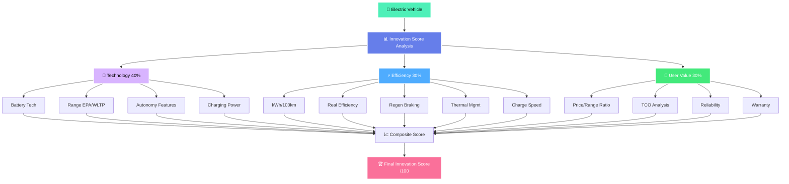
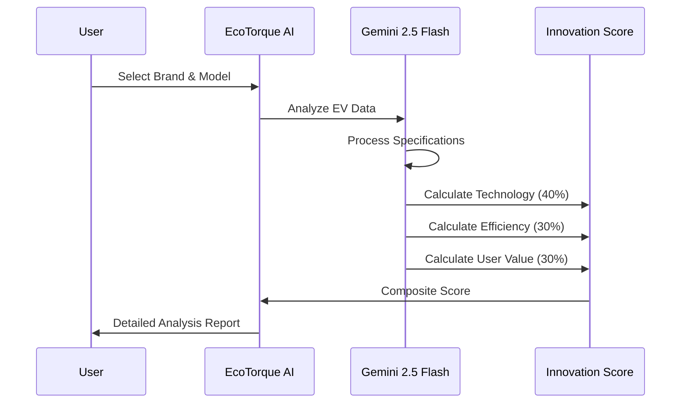
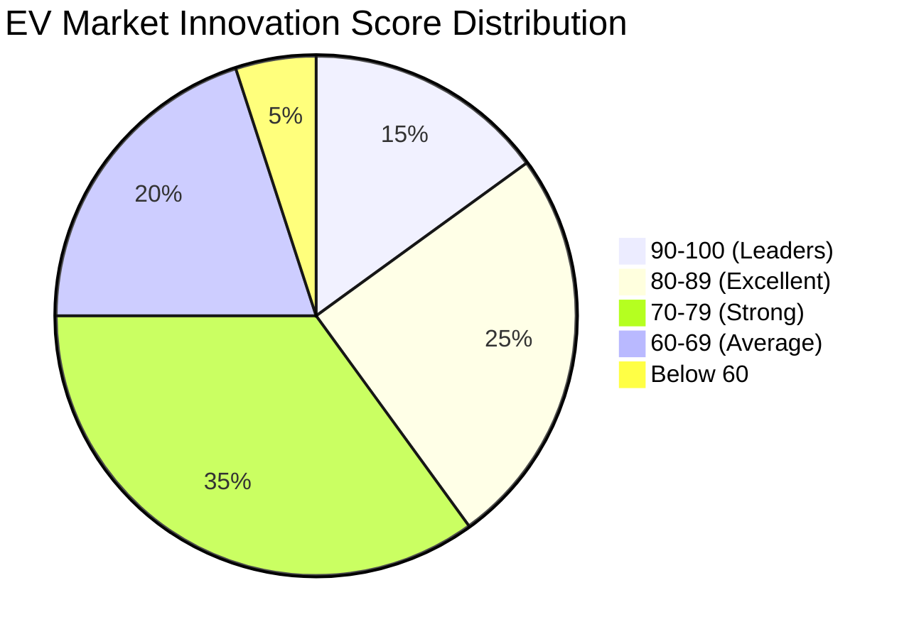

<div align="center">

# ⚡ EcoTorque - Empowering Smarter EV Choices

[](https://python.org)
[](https://streamlit.io)
[](https://deepmind.google/technologies/gemini/)
[](LICENSE)

**Composite Innovation Score • AI-Powered Analysis • Objective EV Comparison**

---

</div>

## 🌟 Overview

**EcoTorque** is an intelligent AI-powered platform that revolutionizes electric vehicle evaluation through a comprehensive **Innovation Score** methodology. Powered by Google's Gemini 2.5 Flash model, it provides objective, data-driven analysis that goes beyond traditional metrics like range and price.

### 🎯 What Makes EcoTorque Special?

- 📊 **Composite Innovation Score** - Holistic evaluation framework
- 🤖 **AI-Powered Analysis** - Deep insights using Gemini AI
- 🎨 **Beautiful Modern UI** - Lottie animations and custom styling
- 🔍 **Multi-Brand Coverage** - Tesla, BYD, MG, Tata, Mahindra, Hyundai & more
- 💬 **Conversational Interface** - Natural language EV consultation
- ⚡ **Real-time Calculations** - Instant Innovation Score generation

---

## 📊 Innovation Score Methodology

<div align="center">




### 🔄 Analysis Workflow



</div>

---

## 🎯 Innovation Score Components

<div align="center">
<table>
<tr>
<td width="33%">

### 🔬 **Technology (40%)**
**Domain:** Technological Advancement

- 🔋 Battery capacity & chemistry
- 📏 EPA/WLTP range ratings
- 🤖 Autonomous driving features
- 📡 OTA software updates
- ⚡ Fast charging capability (kW)

**Weight:** 40 points

</td>
<td width="33%">

### ⚡ **Efficiency (30%)**
**Domain:** Energy Performance

- 📊 kWh per 100km consumption
- 🌍 Real-world efficiency data
- 🔄 Regenerative braking quality
- 🌡️ Thermal management system
- ⏱️ Charging speed (10-80%)

**Weight:** 30 points

</td>
<td width="34%">

### 💎 **User Value (30%)**
**Domain:** Practical Benefits

- 💰 Price-to-range ratio
- 📈 Total cost of ownership
- ⭐ Reliability ratings
- 🚗 Practicality (space/cargo)
- 🛡️ Warranty & service network

**Weight:** 30 points

</td>
</tr>
</table>

### 📐 Score Calculation Formula

```
Innovation Score = (Technology Score × 0.40) + (Efficiency Score × 0.30) + (User Value Score × 0.30)
```

**Range:** 0-100 points  
**Interpretation:**
- 🏆 **90-100:** Industry Leader
- 🥇 **80-89:** Excellent Innovation
- 🥈 **70-79:** Strong Performer
- 🥉 **60-69:** Above Average
- 📊 **Below 60:** Needs Improvement

</div>

---

## ✨ Features

<div align="center">

| Feature | Description | Status |
|---------|-------------|--------|
| 🏠 **Interactive Home** | Feature overview with Lottie animations | ✅ Active |
| 🤖 **AI Chat Assistant** | Conversational EV analysis with Gemini | ✅ Active |
| 📊 **Score Calculator** | On-demand Innovation Score generation | ✅ Active |
| 💬 **Chat History** | 8-message context-aware conversations | ✅ Active |
| 🎨 **Custom Styling** | Beautiful gradients and modern UI | ✅ Active |
| 🔍 **Multi-Brand Support** | Tesla, BYD, MG, Tata, Mahindra, Hyundai | ✅ Active |
| 📱 **Responsive Design** | Desktop and mobile optimized | ✅ Active |
| 🌈 **Visual Feedback** | Loading spinners and status messages | ✅ Active |
| 💾 **Session State** | Persistent conversation management | ✅ Active |
| 🛡️ **Error Handling** | Graceful error messages and recovery | ✅ Active |

</div>

---


## 📸 Application Pages

<div align="center">

### 🏠 Home Dashboard
*Welcome page with Innovation Score methodology overview and feature cards*

**Key Elements:**
- 🎬 Animated EV Lottie graphics
- 📊 Score component breakdown
- 🌟 Why EcoTorque? value propositions
- 🚀 Quick navigation call-to-actions

---

### 💬 AI Chat Interface
*Conversational EV analysis powered by Gemini AI*

**Features:**
- 🤖 Context-aware responses
- 💬 8-message conversation history
- ⚡ Real-time processing indicators
- 📝 Beautiful chat bubble styling

**Example Queries:**
```
"Compare Tesla Model 3 vs BYD Seal using Innovation Score"
"What's the best EV for 100km daily commute?"
"Explain Tata Nexon EV's battery technology"
```

---

### 📊 Innovation Score Calculator
*Interactive tool for analyzing any EV model*

**Workflow:**
1. Select brand from dropdown
2. Enter model name
3. Click "Analyze Innovation Score"
4. View detailed breakdown with justifications

**Output Includes:**
- Technology Score (/40)
- Efficiency Score (/30)
- User Value Score (/30)
- **Final Composite Score (/100)**
- Detailed analysis for each component

---

### ℹ️ About EcoTorque
*Mission, methodology, and creator information*

**Sections:**
- 🎯 Problem statement
- 💡 Solution approach
- 💻 Technology stack
- 👩‍💻 Creator profile
- 🎈 Interactive elements

</div>

---

## 📁 Project Structure

```
ecotorque/
│
├── 📄 main.py                 # Main Streamlit application
│   ├── 🔧 Gemini Configuration
│   ├── 🎨 Page Setup
│   ├── 💅 Custom CSS Styling
│   ├── 🎬 Lottie Animation Loader
│   ├── 🏠 Home Page Component
│   ├── 💬 AI Chat Component
│   ├── 📊 Innovation Score Calculator
│   └── ℹ️ About Page Component
│
├── 📄 mykey.py               # API key configuration (create this)
├── 📄 requirement.txt        # Python dependencies
├── 📄 README.md              # This documentation
│
└── 📁 assets/                # (Optional) Screenshots/media
```

---

## 🛠️ Technology Stack

<div align="center">

### Core Technologies

| Technology | Purpose | Version |
|------------|---------|---------|
|  | Backend Language | 3.8+ |
|  | Web Framework | 1.51.0 |
|  | AI Model | 2.5 Flash |
|  | Animations | 0.0.5 |

---
### API Integration

- **Google Gemini 2.5 Flash** - Natural language understanding
- **Streamlit Framework** - Reactive web components
- **Lottie Animations** - Rich visual experiences

</div>

---

## 💡 Usage Examples

### 🤖 AI Chat Assistant

```
User: "Compare Tesla Model 3 vs BYD Seal"

EcoTorque AI: Let me provide a comprehensive Innovation Score comparison:

Tesla Model 3:
• Technology (40%): 38/40 - Superior autopilot, OTA updates
• Efficiency (30%): 27/30 - Excellent energy consumption
• User Value (30%): 24/30 - Premium pricing impacts value
→ Innovation Score: 89/100 (Excellent Innovation)

BYD Seal:
• Technology (40%): 35/40 - Advanced BYD Blade battery
• Efficiency (30%): 28/30 - Outstanding efficiency
• User Value (30%): 27/30 - Competitive pricing advantage
→ Innovation Score: 90/100 (Industry Leader)

Recommendation: BYD Seal offers better value...
```

### 📊 Innovation Score Calculation

```
User Action: Select "Tata" → Enter "Nexon EV Max" → Click Analyze

EcoTorque Response:
═══════════════════════════════════════
    TATA NEXON EV MAX - INNOVATION ANALYSIS
═══════════════════════════════════════

🔬 TECHNOLOGY SCORE: 30/40
- Battery: 40.5 kWh advanced chemistry ⭐⭐⭐⭐
- Range: 437 km (ARAI) - Class leading ⭐⭐⭐⭐
- Features: Connected car tech, decent ADAS ⭐⭐⭐
- Software: OTA updates available ⭐⭐⭐⭐
- Charging: 7.2 kW onboard, 50 kW DC support ⭐⭐⭐

⚡ EFFICIENCY SCORE: 24/30
- Consumption: 14.8 kWh/100km (competitive) ⭐⭐⭐⭐
- Regen: Multi-mode regenerative braking ⭐⭐⭐⭐
- Real-world: 350-400 km practical range ⭐⭐⭐⭐

💎 USER VALUE SCORE: 27/30
- Price-Range: Excellent ₹18L for 437km ⭐⭐⭐⭐⭐
- TCO: Low maintenance, 8yr warranty ⭐⭐⭐⭐⭐
- Practicality: Compact SUV, spacious ⭐⭐⭐⭐
- Service: Wide Tata network in India ⭐⭐⭐⭐⭐

═══════════════════════════════════════
    FINAL INNOVATION SCORE: 81/100
    RATING: EXCELLENT INNOVATION 🥇
═══════════════════════════════════════
```

## 📊 Innovation Score Distribution

<div align="center">



### 🏆 Sample Rankings by Brand Segment

| Brand | Top Model | Innovation Score | Category |
|-------|-----------|------------------|----------|
| 🇺🇸 **Tesla** | Model 3/Y | 88-92 | Premium Electric |
| 🇨🇳 **BYD** | Seal/Atto 3 | 86-90 | Mass Market Leader |
| 🇮🇳 **Tata** | Nexon EV Max | 78-82 | Value Champion |
| 🇨🇳 **MG** | ZS EV | 75-79 | Competitive Mid-range |
| 🇮🇳 **Mahindra** | XUV400 | 74-78 | Emerging Strong |
| 🇰🇷 **Hyundai** | Ioniq 5 | 85-89 | Technology Pioneer |

</div>

---

## 🎯 Roadmap

### ✅ Phase 1: Foundation (Completed)
- [x] Innovation Score methodology development
- [x] AI-powered chat interface with Gemini
- [x] Multi-page Streamlit application
- [x] Custom UI with Lottie animations
- [x] Support for 6+ major EV brands
- [x] Interactive score calculator

### 🚧 Phase 2: Enhancement (In Progress)
- [ ] Real-time pricing database integration
- [ ] Advanced comparison charts (side-by-side)
- [ ] User rating & review system
- [ ] Export reports as PDF
- [ ] Historical score tracking
- [ ] Regional pricing variants (India/US/EU)

### 🔮 Phase 3: Intelligence (Q2 2025)
- [ ] Machine learning price prediction
- [ ] Sentiment analysis from reviews
- [ ] Predictive market trend analysis
- [ ] Personalized EV recommendations
- [ ] Integration with dealership APIs
- [ ] Mobile app (iOS/Android)

### 🚀 Phase 4: Ecosystem (Q3 2025)
- [ ] Multi-language support (10+ languages)
- [ ] Community forum and discussions
- [ ] EV marketplace integration
- [ ] Charging network mapping
- [ ] Carbon footprint calculator
- [ ] Subscription-based premium features

---


---

## 📄 License

This project is licensed under the **MIT License**.

```
MIT License

Copyright (c) 2025 Stuti Shukla

```


## 👥 Creator

<div align="center">

### **Stuti Shukla**

*Passionate about Sustainable Transportation & AI Innovation*

**Mission Statement:**  
"Democratizing EV knowledge through technology and data-driven insights, empowering informed decisions for a sustainable future."

[](https://github.com/yourusername)
[](https://linkedin.com/in/yourprofile)
[](mailto:your.email@example.com)

### 🎯 Project Motivation

EcoTorque was born from the realization that EV buyers needed an **objective, comprehensive evaluation framework** beyond marketing claims. By combining AI technology with data-driven methodology, EcoTorque aims to bring transparency and insight to the electric vehicle market.

</div>


<div align="center">

## ⚡ EcoTorque - Empowering the Electric Revolution

**Composite Innovation Score • AI-Powered Analysis • Objective EV Comparison**

*Making sophisticated EV analysis accessible to everyone*

---

**Built with ❤️ for a sustainable future**

© 2025 EcoTorque. All Rights Reserved.

---


</div>
